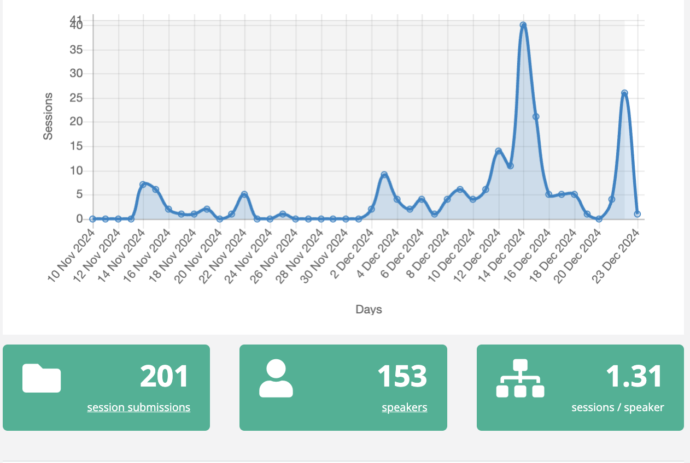
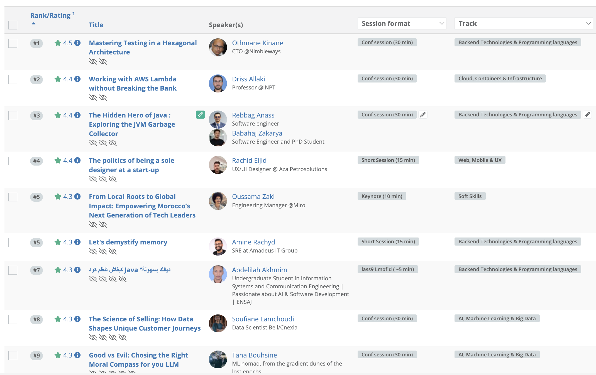

We all agree that content is one of the most important aspects of any conference, along with meeting new people and having a good time. A solid process for selecting content can significantly contribute to the success of any conference.

Having organized the BlablaConf conference for five years now, we have developed a process that we believe works quite well.

As transparency is one of our core values, this article serves to share our process with you. It will provide answers for those interested in submitting a talk in the future, as well as insights into why your talk may not have been selected in the past.

This article only covers the content selection process for BlablaConf, if you are interested in other aspects of the conference feel free to mention it in the comments section and we will cover it in another article.

## 🇲🇦 What is BlablaConf?

For those who don't know, BlablaConf is our annual Geeksblabla community conference entirely in Moroccan Darija. It's a 5+1 days conference with speakers from various backgrounds and levels of expertise share their knowledge and experience with the community. Mostly online with few in-person events around Morocco.

## 📝 Call for papers

After we agree on the date of the conference, typically in the first week of February, we open the call for papers three months prior to the event. The call for papers usually remains open for one and a half months.

If you are not familiar with call for papers (CFP) term, it simply refers to a form that people need to fill out in order be part of the conference as speakers.

We use [sessionize.com](https://sessionize.com/), a platform that helps us collect and manage submissions, making the selection process easier. We want to thank them for their excellent service, as it provides great assistance to us at no cost.

In the call for papers form, we ask for the following information:

- Speaker details
- Talk title: The title of the talk
- Talk description: This section outlines the content of your talk. It is the most important part of the form, so please invest time in writing it.
- Talk level (beginner, intermediate, advanced)
- Talk track: every day we have a different track (`web, Mobile & UX`, `Big data and machine learning`, `Backend & Programming Languages`, `Cloud, Containers & Infrastructure`, `Security & Architecture` ,`Soft Skills & Career`)
- Talk type: keynote, 15min talk, 30min talk.
- Is this your first time speaking at a conference?

After we open the CFP, we begin communicating the CFP to our community members through our social media channels.

Here is the stats of the CFP for the 2025 edition:

> It's important to note that we do not invite speakers and all speakers must submit their talk throw the CFP form.

## 🤝 Content committee

As we believe BlablaConf is a community conference and it's by developers for developers. We create a content committee of around 15 people to help us select the best talks.

For that we create a simple form and share it with the community through our social media channels asking for volunteers to help selecting talks.

Normally we get around 70-100 submissions, and we select around 20 persons to join the content committee.

The committee members are selected based on one rule: we should have a good mix of people with different backgrounds and expertise. You can think of them as a small representation of the Moroccan tech ecosystem that will attend the conference(developers, students, juniors, seniors, etc.).

Here are the faces of the committee members who assisted us in 2025 edition:

All selected committee members will have access to the sessionize.com platform where they can go through the submissions and give their rating and feedback and here are few rules we asked them to follow:

- No need to rate all submissions, you can focus on the ones you are interested in and you know something about. Skip the ones you are not sure about.
- If you think a submission is outstanding, make sure to add a comment for it so we can take it into account.
- Make sure to be objective and fair.

One important thing to note here is that committee members are rating the talk **anonymously** and do not have access to the speakers details. Therefore, **they primarily base their ratings on the title and description**.

By the end of the process we have something similar to this:

## 🥷 Track lead selection

You may notice in the conference live streams that we have a different person hosting each day. Now you know why; we assign a track lead for each day.

The track lead has multiple responsibilities but as part of the content selection process, they need to prepare the draft schedule for their day.

We have a list of rules that we ask the track lead to follow while preparing the draft schedule for their day:

- 1. The rating of the talks should be taken into account.
- 2. The selected talks should be balanced in the terms of level (beginner, intermediate, advanced)
- 3. 30% of speakers should be first time speakers
- 4. Respect conference time constraints, max 10 talks per day, total time 4 hours
- 5. Diversity in terms of topics.

This step is one of the most challenging because you must ensure that the schedule is balanced while respecting nearly all the rules simultaneously.

## 🔥 The long Meeting

Now that we have a draft schedule for each day with selected talks, we hold a meeting with our core team members to finalize it.

The main goal is to review each day, challenge the decisions of the track lead, and ensure that all rules have been followed.

By the end of the meeting, we will have a final schedule for each day, including the exact time for each talk. Some sessions will be added to the acceptance queue in case we need to include more talks.

The last step is to send the acceptance email to all selected speakers. We expect to receive their confirmation within a week; otherwise, we will replace them with the next talk in the acceptance queue.

## 🤷‍♂️ Why was my talk not selected?

By now, you may understand why your past talks might not have been selected. If not, here is a list of reasons based on our experience:

- The description may be unclear or too brief. In the first step of our process, committee members will rate it poorly as they are not aware of the speaker.

- Too many people submit talks on the same topic. Since we strive for a good mix of topics, we may not select your talk even if it's good.

- It's not your fault; we have limited time, and only about 25% of the submitted talks are chosen. keep the momentum and submit again next year.

## 🚨 Conclusion and Good News

We hope this article helps you understand the content selection process for BlablaConf. While we believe the process is fair and transparent, we agree that it's far from perfect and we are always looking for ways to improve it and we would love to hear your feedback and suggestions.

As you may have noticed, more than 200 people submitted their talks for the 2025 edition, but we only selected around 50. We believe we are missing out on many potential speakers and valuable content in Darija. Therefore, we are finalizing updates to the [**lass9 Mofid** ](https://www.youtube.com/playlist?list=PLUa7iphNQNrzEgsERIvKR2tkA1Ra-4Lay) sessions concept to make it a standalone project. This will allow people to submit their talks year-round, not just during BlablaConf week. If you are interested in being the first to host a lass9 Mofid session, please contact us on [Linkedin](https://www.linkedin.com/company/geeksblabla-community/).
